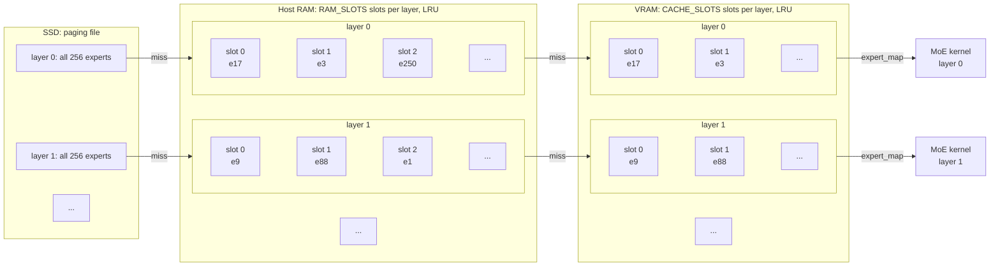

# vllm-expert-pager

vllm-expert-pager is a vLLM plugin for running Mixture-of-Experts (MoE) models
whose expert weights do not fit in GPU memory. It pages expert weights on
demand between VRAM, host RAM, and optionally SSD. Recently used experts stay
cached. On an RTX 4090 (24 GB), a 35B-A3B FP8 model decodes 5.8 times faster
than with vLLM's `--cpu-offload-gb` at the same VRAM budget (see Results).

## How it works



Each MoE layer has its own slots in VRAM and in pinned host RAM, both managed
as LRU caches. An expert missing from a tier is brought in from the tier to its
left: a host thread reads the paging file into RAM, and a Triton kernel copies
RAM into VRAM. When the SSD tier is used, the RAM and SSD tiers hold the rows
losslessly compressed (the fp8 exponents are Huffman coded per row) and a GPU
kernel expands them after the copy. Every decision is made on the GPU, so the
model keeps running under CUDA graphs. When a step needs more experts than
there are slots (large batches, prefill), the layer runs the needed experts
through a small working slab in chunks, reading the next chunk from SSD while
the current one computes, and takes the top-k sum once at the end so the
result matches a single run bit for bit.

## Requirements

- vLLM 0.29.0 (0.28.0 also works). The plugin hooks vLLM internals
  (`RoutedExperts` and the FP8 MoE method), so other versions may not work.
- A MoE model whose expert weights are stored in FP8, served with vLLM's `fp8`
  quantization method. Tested with `Qwen/Qwen3.6-35B-A3B-FP8` on an RTX 4090
  (24 GB) using the Triton FP8 MoE backend.
- A single GPU. Tensor parallelism and expert parallelism are not supported.
- A C compiler (`cc`, or the one named by `CC`). The host thread that serves
  the SSD reads is a small C program compiled with `-march=native` at the
  first start and cached under `~/.cache/vllm_expert_pager` (or
  `$XDG_CACHE_HOME/vllm_expert_pager`).
- Linux. The SSD tier opens the paging file with `O_DIRECT`, so it has to be
  on a filesystem that supports it (ext4 does; `/mnt/c` under WSL2 does not).
  WSL2 itself works, but vLLM 0.29.0 needs `VLLM_WSL2_ENABLE_PIN_MEMORY=1`
  there: its model runner requires pinned host memory, which vLLM disables on
  WSL2 by default.
- Python 3.10 or later.

## Usage

Install into the environment where vLLM is installed:

```bash
pip install git+https://github.com/monochromegane/vllm-expert-pager
```

vLLM discovers the plugin through the `vllm.general_plugins` entry point.
Set `VLLM_PLUGINS` explicitly so that only this plugin loads (when the
variable is unset, vLLM loads every plugin it finds):

```bash
VLLM_PLUGINS=expert_pager \
VLLM_EXPERT_PAGER_CACHE_SLOTS=32 \
VLLM_EXPERT_PAGER_RAM_SLOTS=128 \
VLLM_EXPERT_PAGER_SSD_PATH=/path/to/expert_pager.bin \
vllm serve Qwen/Qwen3.6-35B-A3B-FP8 --max-model-len 4096 --max-num-seqs 1
```

Do not combine it with `--cpu-offload-gb`. The plugin places the expert
weights itself.

### Settings

| Variable | Default | Meaning |
|---|---|---|
| `VLLM_EXPERT_PAGER_CACHE_SLOTS` | `32` | VRAM cache slots per layer. One slot holds one expert. |
| `VLLM_EXPERT_PAGER_RAM_SLOTS` | all experts | RAM-tier slots per layer. Must be at least `CACHE_SLOTS`. When smaller than the number of experts, the rest is paged in from SSD. |
| `VLLM_EXPERT_PAGER_SSD_PATH` | none | Paging file. Required when `RAM_SLOTS` is smaller than the number of experts. It is written at startup and holds every expert of every layer. |
| `VLLM_EXPERT_PAGER_COMPRESS` | `auto` | Whether to keep the RAM and SSD tiers losslessly compressed. `auto` compresses only when the SSD tier is used (`RAM_SLOTS` smaller than the number of experts); `on` and `off` force it. Not supported with the Marlin FP8 MoE backend. |
| `VLLM_EXPERT_PAGER_PITCH` | `0.89` | Fixed length of a compressed row as a ratio of the raw row. If an expert does not fit, startup stops and reports the ratio needed. |
| `VLLM_EXPERT_PAGER_WORKING_ROWS` | `64` | Rows of the working slab used when a step does not fit in the cache slots (prefill). The needed experts run through it in chunks of this many. One slab serves every layer, so a smaller value leaves VRAM for `CACHE_SLOTS`. With compression, `WORKING_ROWS` x raw row must be at least `CACHE_SLOTS` x compressed row (decode borrows the slab as staging). |
| `VLLM_EXPERT_PAGER_LOG_INTERVAL` | `1000` | Log the cache hit rates every N eager forward calls per layer. `0` disables the log. |

Memory use with `Qwen/Qwen3.6-35B-A3B-FP8` (40 MoE layers, 256 experts, 3 MiB
per expert):

| Setting | VRAM for experts | Pinned RAM | SSD |
|---|---|---|---|
| `CACHE_SLOTS=32`, `RAM_SLOTS=256` | 3.9 GiB | 30.4 GiB | not used |
| `CACHE_SLOTS=102`, `RAM_SLOTS=256` | 12.1 GiB | 30.4 GiB | not used |
| `CACHE_SLOTS=32`, `RAM_SLOTS=128` | 4.1 GiB | 13.7 GiB | 26.7 GiB |
| `CACHE_SLOTS=32`, `RAM_SLOTS=128`, `COMPRESS=off` | 3.9 GiB | 15.4 GiB | 30.0 GiB |

The VRAM column is `CACHE_SLOTS` slots plus the shared working slab, and
compression adds the decoding tables on top of it.

## Results

Measured on an RTX 4090 (24 GB) under WSL2 with vLLM 0.29.0 and
`Qwen/Qwen3.6-35B-A3B-FP8`, started with `--max-model-len 4096
--max-num-seqs 1` and vLLM's default CUDA graph mode. The client is
`vllm bench serve` with one concurrent request, the `random` dataset at 1024
input and 256 output tokens, 4 prompts, `--ignore-eos --temperature 0 --seed 0`.
Each configuration was run once to warm the caches and then twice more; the
second measured run is reported. TPOT is the time per output token, TTFT the
time to first token. The baseline is vLLM's own `--cpu-offload-gb`, restricted
to the expert weights with `--cpu-offload-params w13_weight w2_weight` so that
both sides place the same tensors.

| Configuration | VRAM for experts | Pinned RAM | SSD | TPOT | TTFT | Output tok/s |
|---|---|---|---|---|---|---|
| `--cpu-offload-gb 32` (every expert on CPU) | 0 GiB | 30 GiB | - | 90.1 ms | 2719 ms | 10.0 |
| `--cpu-offload-gb 17` | 12.9 GiB | 17 GiB | - | 54.0 ms | 1694 ms | 16.6 |
| `CACHE_SLOTS=32`, `RAM_SLOTS=256` | 3.9 GiB | 30.4 GiB | - | 17.4 ms | 964 ms | 47.4 |
| `CACHE_SLOTS=102`, `RAM_SLOTS=256` | 12.1 GiB | 30.4 GiB | - | 9.3 ms | 779 ms | 81.2 |
| `CACHE_SLOTS=32`, `RAM_SLOTS=256`, `COMPRESS=on` | 4.1 GiB | 27.1 GiB | - | 18.3 ms | 958 ms | 45.6 |
| `CACHE_SLOTS=32`, `RAM_SLOTS=128` | 4.1 GiB | 13.7 GiB | 26.7 GiB | 24.3 ms | 2318 ms | 30.1 |
| `CACHE_SLOTS=32`, `RAM_SLOTS=128`, `COMPRESS=off` | 3.9 GiB | 15.4 GiB | 30.0 GiB | 22.9 ms | 2492 ms | 30.7 |

- With about the same VRAM footprint (`CACHE_SLOTS=102` against
  `--cpu-offload-gb 17`), decoding is 5.8 times faster. Against offloading
  every expert it is 9.7 times faster. At `CACHE_SLOTS=32` — a third of that
  VRAM — it is still 3.1 times faster than `--cpu-offload-gb 17`.
- The SSD tier costs 5.5 ms per token at `RAM_SLOTS=128`, and TTFT grows
  because prefill reads every expert that is not in RAM.

## License

MIT

## Author

[monochromegane](https://github.com/monochromegane)
