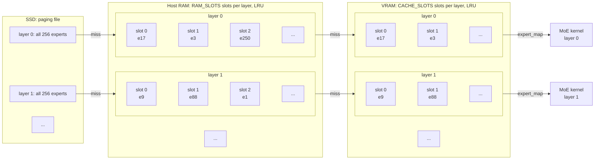

# vllm-expert-pager

vllm-expert-pager is a vLLM plugin for running Mixture-of-Experts (MoE) models
whose expert weights do not fit in GPU memory. It pages expert weights on
demand between VRAM, host RAM, and optionally SSD. Recently used experts stay
cached. On an RTX 4090 (24 GB), a 35B-A3B FP8 model decodes 3.7 times faster
than with vLLM's `--cpu-offload-gb` at the same VRAM budget (see Results).

## How it works



Each MoE layer has its own slots in VRAM and in pinned host RAM, both managed
as LRU caches. An expert missing from a tier is brought in from the tier to its
left: a host thread reads the paging file into RAM, and a Triton kernel copies
RAM into VRAM. Every decision is made on the GPU, so the model keeps running
under CUDA graphs. When a step needs more experts than there are slots (large
batches, prefill), the layer falls back to a working buffer that holds every
needed expert.

## Requirements

- vLLM 0.28.0. The plugin hooks vLLM internals (`RoutedExperts` and the FP8
  MoE method), so other versions may not work.
- A MoE model whose expert weights are stored in FP8, served with vLLM's `fp8`
  quantization method. Tested with `Qwen/Qwen3.6-35B-A3B-FP8` on an RTX 4090
  (24 GB) using the Triton FP8 MoE backend.
- A single GPU. Tensor parallelism and expert parallelism are not supported.
- Linux. The SSD tier opens the paging file with `O_DIRECT`, so it has to be
  on a filesystem that supports it (ext4 does; `/mnt/c` under WSL2 does not).
  WSL2 itself works.
- Python 3.10 or later.

## Usage

Install into the environment where vLLM is installed:

```bash
pip install git+https://github.com/monochromegane/vllm-expert-pager
```

vLLM discovers the plugin through the `vllm.general_plugins` entry point.
Set `VLLM_PLUGINS` explicitly so that only this plugin loads (when the
variable is unset, vLLM loads every plugin it finds):

```bash
VLLM_PLUGINS=expert_pager \
VLLM_EXPERT_PAGER_CACHE_SLOTS=32 \
VLLM_EXPERT_PAGER_RAM_SLOTS=128 \
VLLM_EXPERT_PAGER_SSD_PATH=/path/to/expert_pager.bin \
vllm serve Qwen/Qwen3.6-35B-A3B-FP8 --max-model-len 4096 --max-num-seqs 1
```

Do not combine it with `--cpu-offload-gb`. The plugin places the expert
weights itself.

### Settings

| Variable | Default | Meaning |
|---|---|---|
| `VLLM_EXPERT_PAGER_CACHE_SLOTS` | `32` | VRAM cache slots per layer. One slot holds one expert. |
| `VLLM_EXPERT_PAGER_RAM_SLOTS` | all experts | RAM-tier slots per layer. Must be at least `CACHE_SLOTS`. When smaller than the number of experts, the rest is paged in from SSD. |
| `VLLM_EXPERT_PAGER_SSD_PATH` | none | Paging file. Required when `RAM_SLOTS` is smaller than the number of experts. It is written at startup and holds every expert of every layer. |
| `VLLM_EXPERT_PAGER_LOG_INTERVAL` | `1000` | Log the cache hit rates every N eager forward calls per layer. `0` disables the log. |

Memory use with `Qwen/Qwen3.6-35B-A3B-FP8` (40 MoE layers, 256 experts, 3 MiB
per expert):

| Setting | VRAM for experts | Pinned RAM | SSD |
|---|---|---|---|
| `CACHE_SLOTS=32`, `RAM_SLOTS=256` | about 4.6 GiB | 30.75 GiB | not used |
| `CACHE_SLOTS=32`, `RAM_SLOTS=128` | about 4.6 GiB | 15.75 GiB | 30 GiB |

## Results

Measured on an RTX 4090 (24 GB) under WSL2 with vLLM 0.28.0 and
`Qwen/Qwen3.6-35B-A3B-FP8`, started with `--max-model-len 4096
--max-num-seqs 1` and vLLM's default CUDA graph mode. The client is
`vllm bench serve` with one concurrent request, 1024 input and 256 output
tokens, 4 prompts. TPOT is the time per output token, TTFT the time to first
token. The baseline is vLLM's own `--cpu-offload-gb`.

| Configuration | VRAM for experts | Pinned RAM | SSD | TPOT | TTFT | Output tok/s |
|---|---|---|---|---|---|---|
| `--cpu-offload-gb 32` (every expert on CPU) | 0 GiB | 30 GiB | - | 87.4 ms | 2575 ms | 10.3 |
| `--cpu-offload-gb 17` | 13.0 GiB | 17 GiB | - | 55.8 ms | 1684 ms | 16.1 |
| `CACHE_SLOTS=32`, `RAM_SLOTS=256` | 4.6 GiB | 30.75 GiB | - | 25.7 ms | 1588 ms | 31.4 |
| `CACHE_SLOTS=102`, `RAM_SLOTS=256` | 12.8 GiB | 30.75 GiB | - | 14.9 ms | 1009 ms | 53.2 |
| `CACHE_SLOTS=32`, `RAM_SLOTS=128` | 4.6 GiB | 15.75 GiB | 30 GiB | 39.4 ms | 4428 ms | 17.7 |

- With about the same VRAM footprint (`CACHE_SLOTS=102` against
  `--cpu-offload-gb 17`), decoding is 3.7 times faster. Against offloading
  every expert it is 5.9 times faster.
- The SSD tier costs about 14 ms per token at `RAM_SLOTS=128`, and TTFT grows
  because prefill reads every expert that is not in RAM.
- vLLM ships no tuned FP8 GEMM config for the RTX 4090. With one (independent
  of this plugin), `CACHE_SLOTS=102` reaches 13.3 ms per token.

## License

MIT

## Author

[monochromegane](https://github.com/monochromegane)
